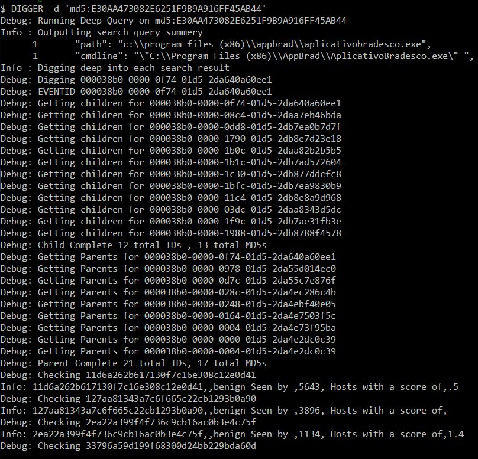
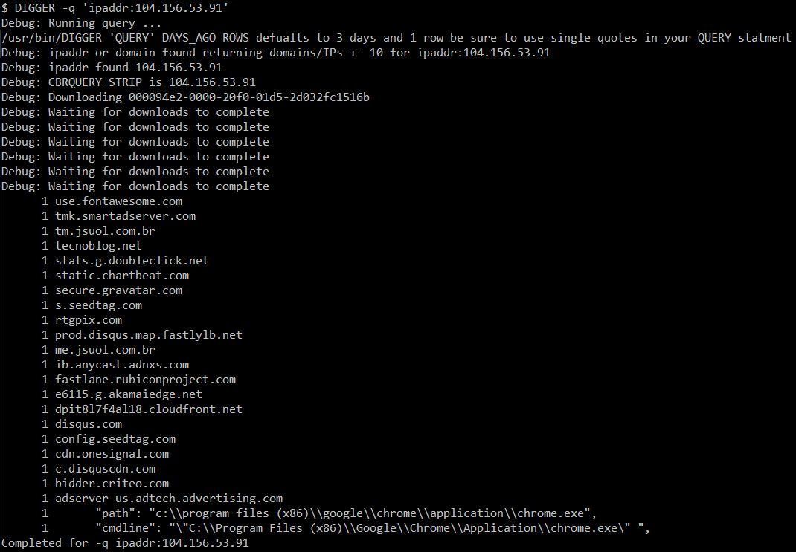
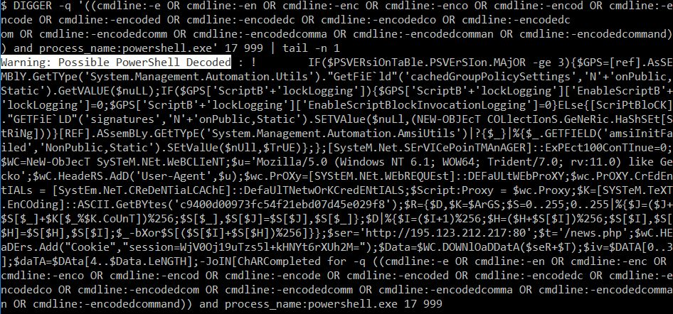
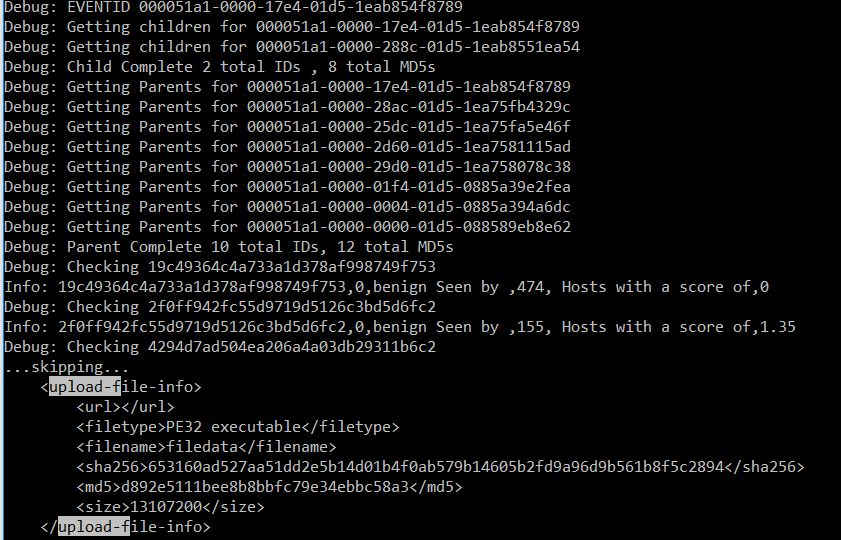

# DIGGER
Bash Scripts to query CBR,Cloud API's and generally automate the IR process.

Requirments:
* Cygwin (curl , gwak ,7zip ,bc god knows what else)
* *nix 

Put your super secret sensitive info here

export CBRapikey=' XXXXXXXXXXXXXX'

export WildFireapikey='XXXXXXXXX '

export CBRdomain='XXXXXXXXXXXXX'

# Usage

DIGGER -q " \'QUERY\''  DAYS_AGO ROWS (returns cmd the defualts to  1 row and 3 days be sure to use single quotes in your QUERY statment and max rows"

DIGGER  -d " \'QUERY\''  DAYS_AGO ROWS (Same as -q but runs deep search on every search result"

DIGGER  -e EVENTID \( Does a deep search for an even ID up and down the process tree \)

DIGGER  -w \( backups watchlist and CBR TI feeds 1 to 50 \)

# Features

queries with domain and ipaddr digging +-10 from the netconns near the requested IP/Domain ion CBR

automated decoding of powershell when using -q command

automated upload of unknown MD5's to Wildfire from CBR 

# Config

edit export varfilter=  to add and aditonal fields you would like to return in the search from CBR

# Todo

Virus Total Domain/IP Reputation via API

Deepdig Summery : not begin

Deepdig Summery : md5 seen <100 computers

Deepdig Summery : powershell 

Deepdig Summery : remove dupicate-ish lines   dupes some how.. Md5 ? username ? or remove MD5 check ? 

ipaddr:/domain: if no results found search Splunk etc for IP

ipaddr:/domain: perform checks on domains censys.io

ipaddr:/domain: domain rep using VT

replace cmdline and path random strings and numbers with _RANDOM_ sed -r 's/[A-Z|a-z|0-9]{120}/_RANDOM_/g'|sed -r 's/[0-9]{4,999}/_RANDOM_/g' for deduping etc

WildFire Link API ?

digg more on Seen < 100 or > 5K whitelist  / not signed etc 

add live search : part of live TH script

search BHO's chrome 

search BHO's IE

splunk: username lookup on workstatoin > username 

splunk: username lookup on username from path/cmdline data like in c:\users\bob 

# Screenshots

-q 'md5:E30AA473082E6251F9B9A916FF45AB44'

-q 'ipaddr:'

Auto decode powershell

Auto upload Wildfire

